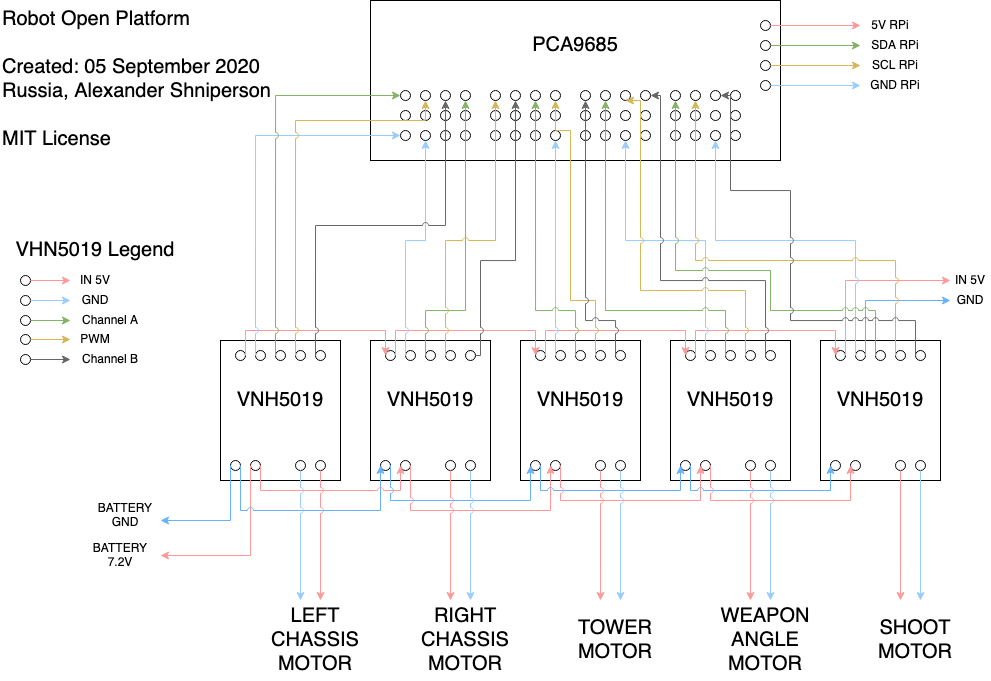
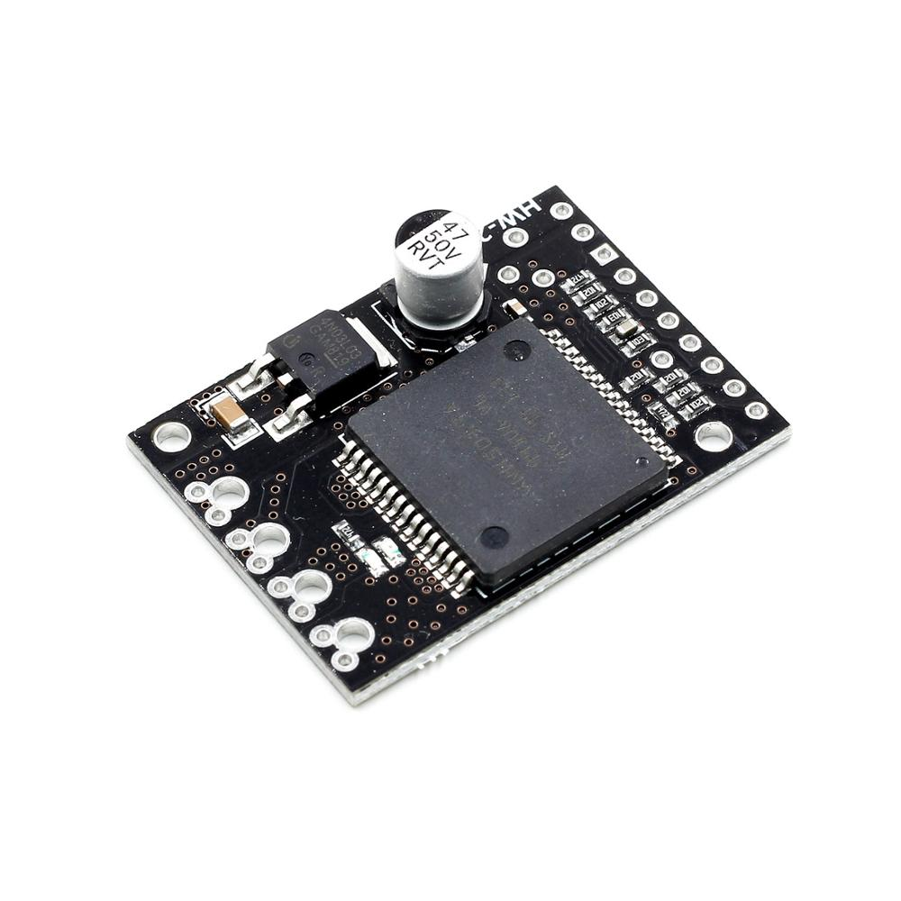

# Robot Open Platform
Robot open platform with shared schema circuit and some source code

### How it looks

### Circuit schema

### Details
* [Raspberry Pi Zero W](https://a.aliexpress.com/_eNyAUF)

* [PCA9685](https://a.aliexpress.com/_eKJRCf)

* [VNH5019](https://a.aliexpress.com/_eNv91t)

* [DC-DC UpDown Voltage XL6019](https://a.aliexpress.com/_etnnYP)

* [Soldering iron CXG 936d](https://a.aliexpress.com/_esIbTl)

* [Dupont 2.54 mm](https://a.aliexpress.com/_eOq5BV)

* [Dupont shield 2x20 pin 2.54](https://a.aliexpress.com/_eNs7vh)

* Micro USB Connector (left ot right oriented)

* [Rechargeable battery 26650](https://a.aliexpress.com/_eM5PgJ)

* [Lii 402 charger](https://a.aliexpress.com/_eK1RMr)

* [Battery case 26650](https://a.aliexpress.com/_eO5ha7)

